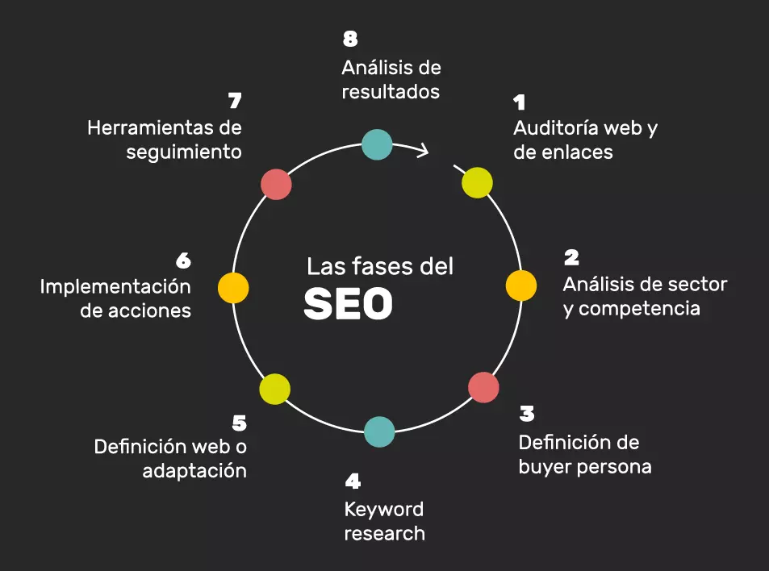

# Tema 1: Pilares en una Estrategia SEO: SEO Técnico, Contenidos y Autoridad

1. Introducción

# ¿Qué es el SEO?

El **SEO** (Search Engine Optimization), o **Optimización para Motores de Búsqueda**, es un conjunto de técnicas y prácticas destinadas a mejorar la **visibilidad** y **posicionamiento** de un sitio web en los motores de búsqueda, como Google, Bing o Yahoo. El objetivo principal del SEO es que las páginas de un sitio aparezcan en los primeros resultados cuando los usuarios realizan búsquedas relacionadas con los productos, servicios o información que ofrece dicho sitio.

## ¿Cómo funciona el SEO?

Los motores de búsqueda utilizan algoritmos complejos para determinar qué páginas web son más relevantes para una determinada consulta de búsqueda. Estos algoritmos tienen en cuenta múltiples factores, como la calidad del contenido, la experiencia del usuario, los enlaces que apuntan al sitio (backlinks) y la estructura técnica de la página.

Existen dos tipos principales de SEO:

### 1. SEO On-Page (SEO en la página)

Se refiere a las optimizaciones que se realizan directamente en el contenido y la estructura del sitio web. Esto incluye:

- **Uso de palabras clave** relevantes en el contenido.
- **Optimización de las meta etiquetas** como el título (`<title>`) y la descripción (`<meta description>`).
- **Calidad del contenido**, incluyendo textos bien redactados, imágenes y videos.
- **Velocidad del sitio web**, que afecta tanto a la experiencia del usuario como al posicionamiento.
- **Estructura de URL** clara y amigable.
- **Optimización para dispositivos móviles**, dado que muchas búsquedas se realizan desde smartphones y Google prioriza sitios con buena experiencia móvil.

### 2. SEO Off-Page (SEO fuera de la página)

Involucra acciones que se realizan fuera del sitio web para mejorar su autoridad y relevancia en Internet. El factor más importante aquí es la **construcción de enlaces (link building)**, que implica obtener enlaces desde otros sitios web hacia el tuyo. Los motores de búsqueda consideran que, si otros sitios enlazan al tuyo, es una señal de que tu contenido es valioso y confiable.

## ¿Por qué es importante el SEO?

El SEO es crucial porque la mayoría de las personas no pasa de la primera página de resultados de búsqueda. Si un sitio web no aparece en los primeros lugares, es menos probable que reciba visitas. Con una estrategia SEO adecuada, las empresas pueden:

- **Atraer tráfico orgánico** (sin pagar por publicidad).
- **Aumentar la visibilidad** y el reconocimiento de marca.
- **Conseguir más clientes potenciales** o conversiones.

En resumen, el SEO es una herramienta fundamental para cualquier sitio web que busque destacar en Internet, ya que mejora la posición en los motores de búsqueda y, con ello, la visibilidad y el tráfico orgánico.

El SEO se basa en tres pilares fundamentales que deben trabajarse de forma conjunta para mejorar la visibilidad de un sitio web en los motores de búsqueda. Estos pilares son:

* SEO técnico: Optimización de la estructura interna y rendimiento del sitio.

* Contenidos: Creación de contenido valioso y relevante para los usuarios.

* Autoridad: Reputación del sitio, medida principalmente a través de backlinks de calidad.

* Gráfico sugerido: Un diagrama de tres círculos interconectados que representan cada pilar (SEO técnico, contenidos y autoridad), mostrando su interrelación para formar una estrategia SEO sólida.  

