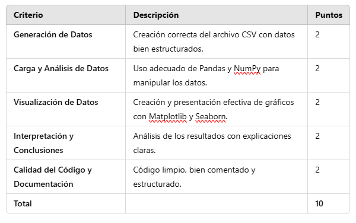

# Proyecto: Análisis de Datos SEO con Python

## Enunciado

El objetivo de este proyecto es desarrollar un análisis detallado de datos SEO utilizando Python. Los estudiantes deberán generar un conjunto de datos ficticio en formato CSV, procesarlo con Pandas y NumPy, y visualizar las métricas clave con Matplotlib y Seaborn.

El informe final debe incluir:

1. Generación de Datos: Creación de un archivo CSV con datos simulados de visitas, tiempo en página, tasa de rebote, conversiones y páginas por sesión.

2. Carga y Procesamiento de Datos: Lectura del archivo CSV y análisis preliminar con Pandas.

3. Visualización de Datos:

    - Gráfico de tendencias de visitas.

    - Histograma del tiempo promedio en página.

    - Mapa de calor de correlación entre métricas.

    - Relación entre visitas y conversiones mediante un gráfico de dispersión.

4. Conclusiones: Interpretación de los resultados y posibles mejoras en SEO basadas en los datos.

**Criterios de Evaluación**

El proyecto se calificará sobre 10 puntos según los siguientes criterios:

## Entrega

- El proyecto debe entregarse en un Jupyter Notebook (.ipynb) o en un script de Python (.py).

- Se debe adjuntar el archivo CSV generado.

- La fecha límite de entrega es 21 de Febrero a las 11.00h (Vía Aula Virtual - Tarea Parcial Segundo Trimestre)
- Después se realizará una sesión de evaluación los días 26 y 27 para realización de preguntas a los alumnos sobre su trabajo.
- La no entrega en fecha y hora será motivo de califidación NP.
- Si la entrega no se corresponde a lo solicitado o tiene problemas para abrirse o de formato ilegible. La calificación será de 1.