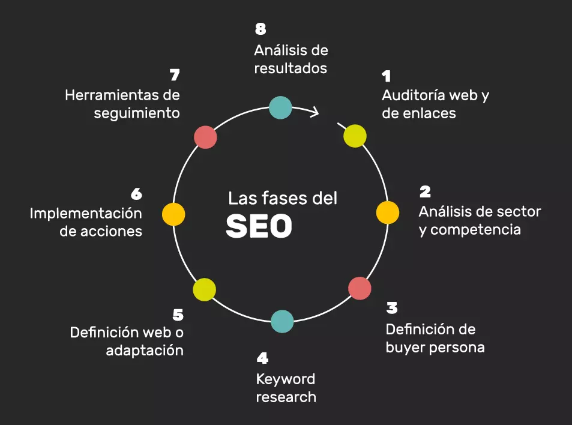

# Tema 1: Pilares en una Estrategia SEO: SEO Técnico, Contenidos y Autoridad

1. Introducción

El SEO se basa en tres pilares fundamentales que deben trabajarse de forma conjunta para mejorar la visibilidad de un sitio web en los motores de búsqueda. Estos pilares son:

* SEO técnico: Optimización de la estructura interna y rendimiento del sitio.

* Contenidos: Creación de contenido valioso y relevante para los usuarios.

* Autoridad: Reputación del sitio, medida principalmente a través de backlinks de calidad.

* Gráfico sugerido: Un diagrama de tres círculos interconectados que representan cada pilar (SEO técnico, contenidos y autoridad), mostrando su interrelación para formar una estrategia SEO sólida.  

